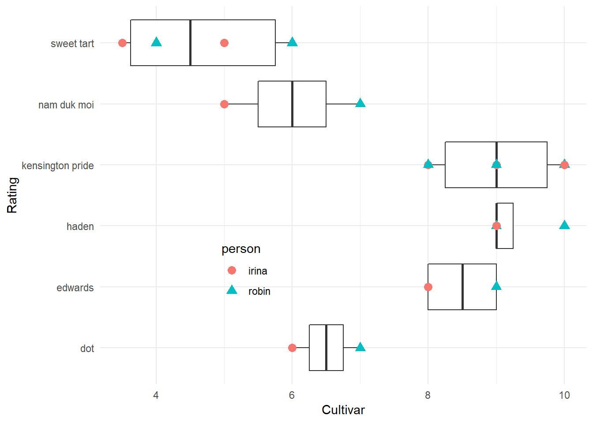

## The Data

```r
library(tidyverse)
```

```
## -- Attaching packages ---------- tidyverse 1.2.1 --
```

```
## v ggplot2 2.2.1     v purrr   0.2.4
## v tibble  1.4.2     v dplyr   0.7.4
## v tidyr   0.8.0     v stringr 1.3.1
## v readr   1.1.1     v forcats 0.3.0
```

```
## -- Conflicts ------------- tidyverse_conflicts() --
## x dplyr::filter() masks stats::filter()
## x dplyr::lag()    masks stats::lag()
```

```r
mango<- read_csv("data/mango_data.csv") %>%
  mutate(cultivar = tolower(cultivar)) %>%
  mutate(person = tolower(person))
```

```
## Parsed with column specification:
## cols(
##   cultivar = col_character(),
##   size = col_character(),
##   stringiness = col_character(),
##   taste = col_character(),
##   date = col_character(),
##   person = col_character(),
##   rating = col_double()
## )
```

My wife and I rated the mangoes over the course of about a week, tasting the different varieties as they felt more and more ripe. We each did a subjective rating of 1-10, with 1 being "this tastes terrible", and 10 being "this is literally the best mango I've ever had". We rated independent of each other, recording our ratings, and I collated the data for this dataset.

## How Did They Perform?


```r
ggplot(mango, aes(cultivar, rating))+
  geom_boxplot()+
  geom_point(aes(shape=person, color=person), size=3)+
  theme_minimal()+
  theme(legend.position = c(.3, 0.3))+
  coord_flip() +
  xlab("Rating")+
  ylab("Cultivar")
```



So overall, it looks like *Kensington Pride*, *Hayden*, and *Edwards* were clear winners, and the other varieties were not. What happened?

If you look at the other data in the file (filled with NA's, sorry) there are notes on the stringiness and the taste of the varieties. Poor varieties like *Sweet Tart* had chalky texture in the mouth, and would sometimes smell like tylenol, or have no aroma at all. Good performers had very slight to no stringiness, and had the kind of 'quintessential' tastes of mango: fruity, tropical, rich. *Kensington Pride* was my favorite, and it tasted a bit like muscadine grapes. Mid-performers like *Nam Duk Moi* had stringiness, and *Dot* would sometimes have a popcorn like flavor, or tasted too sweet.

## Conclusions

If you are in Miami area in July, you NEED to taste mangoes. They grow on street trees, make friends, knock on doors, see if people will sell them to you. Have fun!
